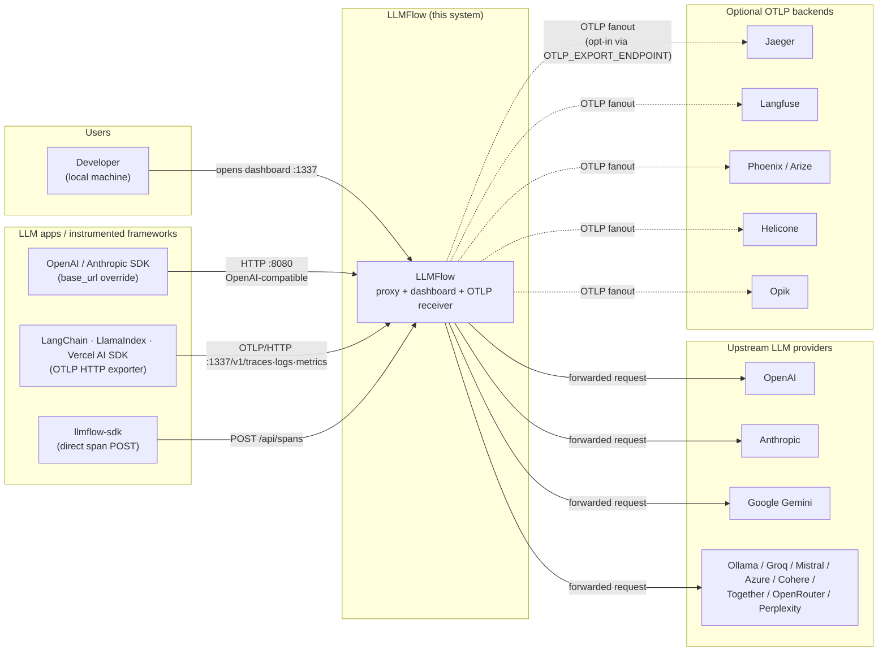
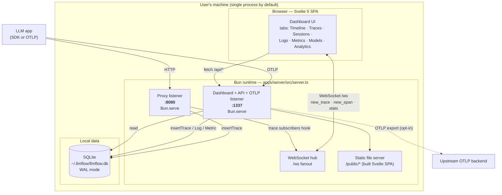
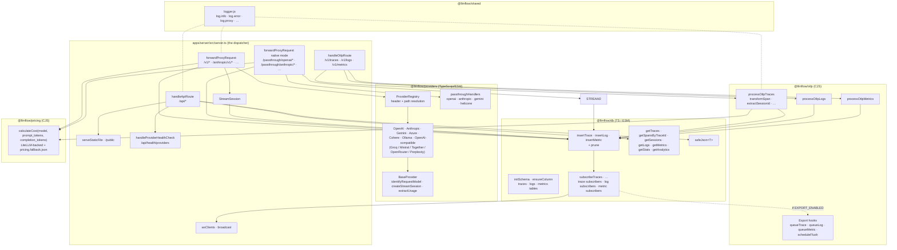
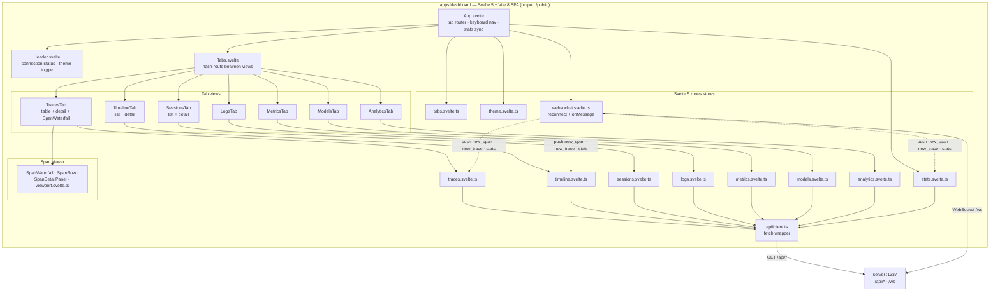
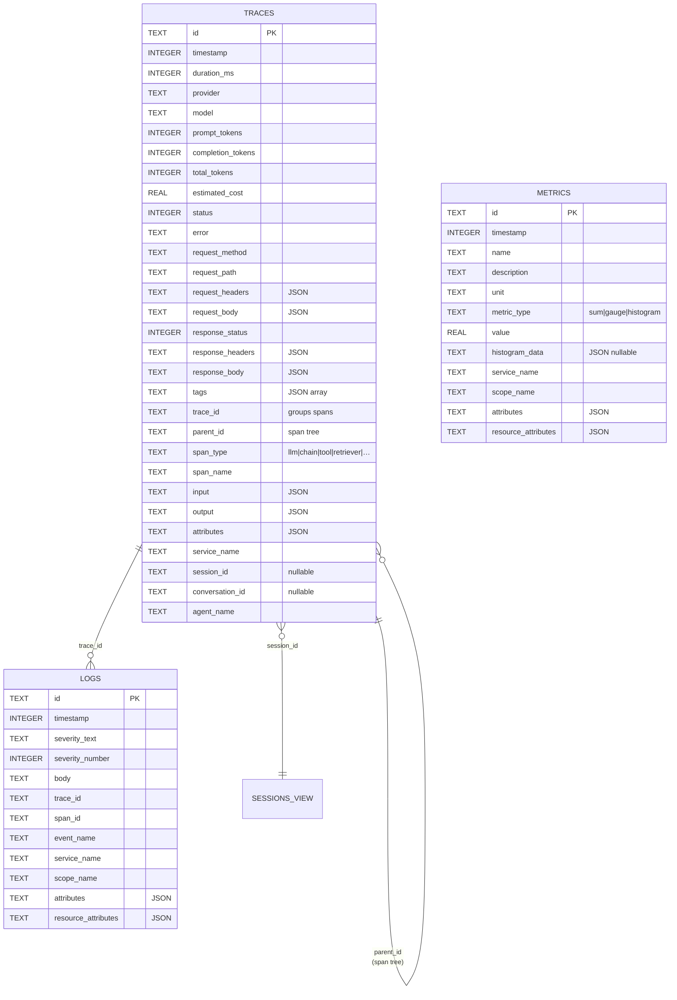
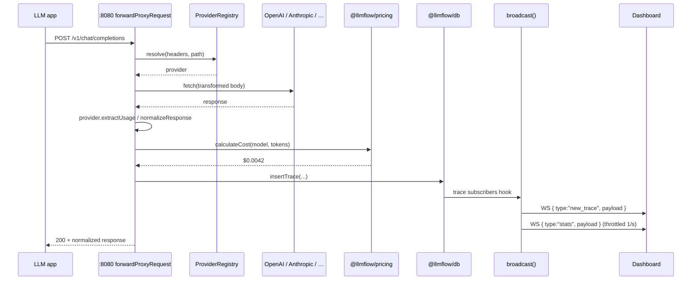
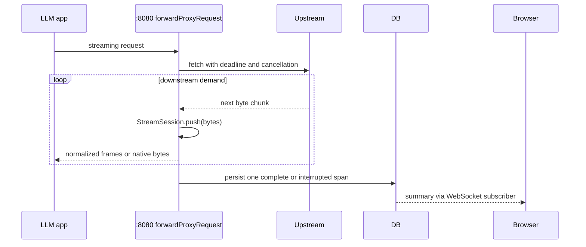
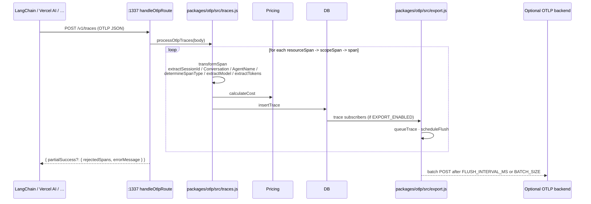
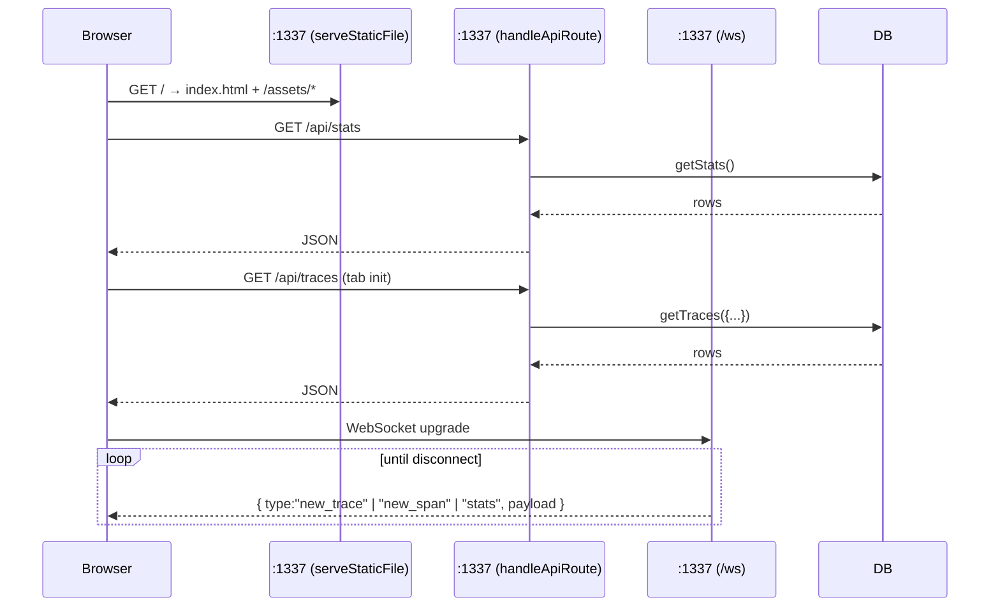

# LLMFlow — Architecture

A C4-style view of LLMFlow: a local-first observability tool for LLM applications. LLMFlow accepts traffic three ways — as an HTTP proxy in front of LLM APIs, as an OTLP receiver, or via its own SDK — and surfaces traces, logs, metrics, and sessions in a Svelte dashboard.

This document tracks the implementation as of `main` (post-`0f287cc`, "Span viewer + session correlation + docs sweep"). Diagrams use Mermaid. The conventions are loose C4 — Context → Container → Component — with one extra section for the data model and one for runtime flows.

## C1 — System Context



**Three ingest paths, one storage:**

| Ingest path      | Port             | Endpoint shape                                | What gets stored                                           |
| ---------------- | ---------------- | --------------------------------------------- | ---------------------------------------------------------- |
| Proxy mode       |                  | `/v1/*`, `/anthropic/v1/*`, `/gemini/v1/*`, … | Full request + normalized response, usage, cost, latency   |
| Passthrough mode |                  | `/passthrough/<provider>/*`                   | Raw upstream bytes; logging is side-channel via stream tee |
| OTLP receiver    | (dashboard port) | `/v1/traces`, `/v1/logs`, `/v1/metrics`       | Transformed OTLP spans / log records / metric points       |
| SDK direct       |                  | `POST /api/spans`                             | One synthetic span per call                                |

**Optional egress:** if `OTLP_EXPORT_ENDPOINT` is set, every inserted row is also re-emitted as OTLP to one upstream backend. See `packages/otlp/src/export.js`.

## C2 — Containers



**Two listeners, one process.** The Node launcher `bin/llmflow.js` spawns the bundled Bun server (`dist/server.js`; source in an unbuilt checkout), which boots two `Bun.serve(...)` calls (gated behind `if (import.meta.main)` since `dac0958`):

- **Proxy listener** (`PROXY_PORT`, default `8080`) — only LLM provider traffic.
- **Dashboard listener** (`DASHBOARD_PORT`, default `1337`; startup fails explicitly if the configured port is taken) — serves the SPA, the REST API, the OTLP receiver, and the `/ws` WebSocket on the same port.

**Storage is one SQLite file** (`bun:sqlite`, WAL + `busy_timeout=5000` + `synchronous=NORMAL`, configured in `packages/db/src/index.ts-24`). Three tables — `traces`, `logs`, `metrics` — with trace-aware retention (capped at `MAX_TRACES` span rows, default 10k). The dashboard never talks to SQLite directly; every read goes through `/api/*`.

**Realtime path.** `packages/db/src/index.ts` exposes `subscribeTraces` / `subscribeLogs` / `subscribeMetrics`. The server registers a hook that broadcasts `new_trace` / `new_span` and a throttled `stats` payload to all WebSocket clients. The dashboard's `websocket.svelte.ts` reconnects with backoff and dispatches messages to registered handlers per tab store.

## C3 — Components (server-side)



**File map for the components above:**

| Component              | File                                                                   |
| ---------------------- | ---------------------------------------------------------------------- |
| `handleApiRoute`       | `apps/server/src/server.ts`                                            |
| `handleOtlpRoute`      | `apps/server/src/server.ts`                                            |
| `forwardProxyRequest`  | `apps/server/src/proxy.ts`                                             |
| Native passthrough     | `apps/server/src/proxy.ts`                                             |
| `StreamSession`        | `packages/providers/src/stream.ts`                                     |
| WebSocket hub          | `apps/server/src/server.ts` (`wsClients`), (`broadcast`)               |
| `ProviderRegistry`     | `packages/providers/src/index.ts`                                      |
| `BaseProvider`         | `packages/providers/src/base.ts`                                       |
| OTLP traces processing | `packages/otlp/src/traces.js` (`transformSpan`, `processOtlpTraces`)   |
| OTLP export            | `packages/otlp/src/export.js` (`initExportHooks`)                      |
| DB writes / reads      | `packages/db/src/index.ts` (`insertTrace`, `getTraces`, `getSessions`) |
| `safeJson`             | `packages/db/src/index.ts`                                             |
| Pricing                | `packages/pricing/src/index.js` (`calculateCost`)                      |
| Logger                 | `packages/shared/src/logger.js`                                        |

## C3 — Components (dashboard)



The SPA is a hash-routed tab switcher (`tabs.svelte.ts`) with one store per data type. Stores hydrate via `api/client.ts` and live-update via the WebSocket store, which is registered once in `App.svelte` (`onMount` -> `initWebSocket`). The span viewer (`SpanWaterfall.svelte`, `viewport.svelte.ts`) is virtualized so very wide traces (~5k spans) stay smooth.

## Data Views

Every tab in the dashboard maps to a specific subset of the schema. This table is the load-bearing one for understanding the product.

| Tab           | API surface                                                                                                                                                                                            | DB query function                                                                                                                                  | What it shows                                                                                                                                                                                                        |
| ------------- | ------------------------------------------------------------------------------------------------------------------------------------------------------------------------------------------------------ | -------------------------------------------------------------------------------------------------------------------------------------------------- | -------------------------------------------------------------------------------------------------------------------------------------------------------------------------------------------------------------------- |
| **Timeline**  | `GET /api/timeline?type=trace\|log&q=&tool=&date_from=`                                                                                                                                                | `getTraces` + `getLogs`, merged + sorted by timestamp                                                                                              | Unified reverse-chronological feed of traces and logs (no metrics)                                                                                                                                                   |
| **Traces**    | `GET /api/traces?limit&offset&model&status&q&provider&session_id&conversation_id&date_from&date_to` -> list; `GET /api/traces/:id` -> detail; `GET /api/traces/:id/tree` -> full span tree             | `getTraces` / `getTraceById` / `getSpansByTraceId`                                                                                                 | Table of root spans; detail view with request/response; tree view feeds `SpanWaterfall`                                                                                                                              |
| **Sessions**  | `GET /api/sessions?limit&offset`; `GET /api/sessions/:id`                                                                                                                                              | `getSessions` / `getSessionCount` / `getSessionTraces`                                                                                             | Multi-trace sessions correlated by `session_id` (filled from `session.id`, `langsmith.trace.session_id`, `traceloop.association.properties.session_id`, `ai.telemetry.metadata.sessionId`, or `service.instance.id`) |
| **Logs**      | `GET /api/logs?service_name&event_name&trace_id&severity_min&q`; `GET /api/logs/filters`; `GET /api/logs/:id`                                                                                          | `getLogs` / `getLogCount` / `getLogById` / `getDistinctLogServices` / `getDistinctEventNames`                                                      | OTLP log records ingested via `/v1/logs`, joinable to traces via `trace_id`                                                                                                                                          |
| **Metrics**   | `GET /api/metrics?name&service_name&metric_type` + `?aggregation=summary`; `GET /api/metrics/filters`; `GET /api/metrics/:id`; `GET /api/metrics/summary?date_from&date_to`; `GET /api/metrics/tokens` | `getMetrics` / `getMetricCount` / `getMetricById` / `getMetricsSummary` / `getTokenUsage` / `getDistinctMetricNames` / `getDistinctMetricServices` | OTLP metric points (sum / gauge / histogram), plus a derived token-usage rollup                                                                                                                                      |
| **Models**    | `GET /api/models` (derived from `db.getStats()`)                                                                                                                                                       | `getStats` (group-by model)                                                                                                                        | Per-model request count, tokens, cost — derived view                                                                                                                                                                 |
| **Analytics** | `GET /api/analytics?days=30` (combined) and individual: `/api/analytics/daily`, `/api/analytics/cost-by-tool`, `/api/analytics/cost-by-model`, `/api/analytics/token-trends?interval=hour&days=7`      | `getDailyStats` / `getCostByTool` / `getCostByModel` / `getTokenTrends`                                                                            | Time-bucketed cost + token charts, with `tool`/`model` cost breakdown sanitized for display                                                                                                                          |

### Read-only API endpoints (full list)

```
GET  /api/health
GET  /api/health/providers
GET  /api/stats
GET  /api/models
GET  /api/traces                       ?limit&offset&model&status&q&provider&session_id&conversation_id&date_from&date_to
GET  /api/traces/:id
GET  /api/traces/:id/tree
GET  /api/traces/export                (CSV export)
GET  /api/sessions                     ?limit&offset
GET  /api/sessions/:id
GET  /api/timeline                     ?type=trace|log&limit&q&tool&date_from
GET  /api/logs                         ?service_name&event_name&trace_id&severity_min&q&limit&offset
GET  /api/logs/filters
GET  /api/logs/:id
GET  /api/metrics                      ?name&service_name&metric_type&aggregation=summary&limit&offset
GET  /api/metrics/filters
GET  /api/metrics/summary              ?date_from&date_to
GET  /api/metrics/tokens
GET  /api/metrics/:id
GET  /api/token-usage
GET  /api/analytics                    ?days=30
GET  /api/analytics/daily              ?days=30
GET  /api/analytics/cost-by-tool       ?days=30
GET  /api/analytics/cost-by-model      ?days=30
GET  /api/analytics/token-trends       ?interval=hour|day&days=7
POST /api/spans                        (SDK direct insertion)
WS   /ws                               new_trace · new_span · stats messages
```

### Ingest endpoints

```
POST /v1/traces      OTLP traces      (port :1337)
POST /v1/logs        OTLP logs        (port :1337)
POST /v1/metrics     OTLP metrics     (port :1337)

/v1/*                OpenAI proxy             (port :8080, default)
/anthropic/v1/*      Anthropic proxy
/gemini/v1/*         Gemini proxy
/azure/v1/*          Azure OpenAI proxy
/cohere/v1/*         Cohere proxy
/ollama/v1/*         Ollama proxy
/groq/v1/*           OpenAI-compatible proxy
/mistral/v1/*        OpenAI-compatible proxy
/together/v1/*       OpenAI-compatible proxy
/openrouter/v1/*     OpenAI-compatible proxy
/perplexity/v1/*     OpenAI-compatible proxy

/passthrough/openai/*       raw bytes, side-channel logging
/passthrough/anthropic/*    raw bytes
/passthrough/gemini/*       raw bytes
/passthrough/helicone/*     raw bytes
```

## Data Model



A few things worth knowing about this schema:

- **Spans are self-referencing.** `traces.parent_id` builds the tree; `traces.trace_id` groups spans belonging to the same root. The "list of traces" view filters to rows where `parent_id IS NULL`.
- **Sessions are a query, not a table.** `getSessions` does a `SELECT … GROUP BY session_id` over `traces`. There's no separate sessions table — sessions exist only as a view over labeled traces.
- **JSON columns everywhere.** Headers, bodies, attributes, and tags are all stored as `TEXT` containing JSON. Reads go through `safeJson` (after `dac0958`) so malformed bodies don't 500 the API.
- **Trace retention evicts logical traces as units.** Indexed group counts track insertion/deletion; the oldest group is evicted on overflow. Oversized traces are evicted in full and bounded eviction markers flag late fragments. Logs and metrics retain their row-based caps (`MAX_LOGS=100000`, `MAX_METRICS=1000000`). See the README for timestamp, partial-data and session ownership policies.

## Runtime Flows

### Proxy request (non-streaming)



### Proxy request (streaming SSE)

The streaming path pulls each upstream chunk once. A request-scoped `StreamSession` incrementally parses event boundaries and cumulative usage with bounded capture. Normalized routes emit OpenAI-style chat chunks; native passthrough routes preserve upstream bytes. Backpressure, deadlines and cancellation share the same reader and abort controller.



### OTLP ingest



### Dashboard load + live updates



## Module dependency graph

```mermaid
graph LR
    subgraph apps
        SERVER[apps/server]
        DASHBOARD2[apps/dashboard]
    end
    subgraph packages
        DB[@llmflow/db]
        OTLP[@llmflow/otlp]
        PROV[@llmflow/providers]
        PRICE[@llmflow/pricing]
        SHARED[@llmflow/shared]
        SDK[llmflow-sdk]
    end
    SERVER --> DB
    SERVER --> OTLP
    SERVER --> PROV
    SERVER --> PRICE
    SERVER --> SHARED
    OTLP --> DB
    OTLP --> PRICE
    OTLP --> SHARED
    PROV --> SHARED
    DASHBOARD2 -.->|"build output to /public"| SERVER
    SDK -.->|"POST /api/spans"| SERVER
```

`@llmflow/db` and `@llmflow/providers` are TypeScript/ESM. The server imports their types directly. OTLP, pricing, and shared remain CJS (`require()`-style). The dashboard is built and served as static files; it doesn't import server code.

## Cross-cutting concerns

| Concern                 | Where it lives                                                                                       | Notes                                                                                                                                     |
| ----------------------- | ---------------------------------------------------------------------------------------------------- | ----------------------------------------------------------------------------------------------------------------------------------------- |
| **Logging**             | `packages/shared/src/logger.js`                                                                      | `log.info`, `log.error`, `log.proxy`, `log.otlp`, `log.debug`. `VERBOSE=1` enables debug.                                                 |
| **Cost calculation**    | `packages/pricing/src/index.js`                                                                      | Backed by LiteLLM pricing JSON, falls back to bundled `pricing.fallback.json`.                                                            |
| **Provider resolution** | `ProviderRegistry.resolve` in `packages/providers/src/index.ts`                                      | Reads `X-LLMFlow-Provider` header first, then path prefix.                                                                                |
| **OTLP fanout**         | `packages/otlp/src/export.js`                                                                        | One upstream endpoint via `OTLP_EXPORT_ENDPOINT`; batched (`BATCH_SIZE` rows or `FLUSH_INTERVAL_MS`). Headers from `OTLP_EXPORT_HEADERS`. |
| **Realtime fanout**     | `broadcast()` in `apps/server/src/server.ts` over `wsClients` set                                    | Stats throttled to 1/sec; normal close and failed sends remove clients.                                                                   |
| **Static assets**       | `serveStaticFile` at `apps/server/src/server.ts` + `/public/` from `bun run build` of the Svelte SPA | The dashboard ships baked into the npm tarball and the Docker image.                                                                      |
| **CORS**                | wide-open `*` in `startProxyServer`                                                                  | Intentional for the local development workflow.                                                                                           |
| **Auth**                | None today                                                                                           | Local tool: no login/token setup or planned bearer-auth layer.                                                                            |

## Where to start reading

If you only have time for a few files:

1. `apps/server/src/server.ts` — the dispatcher. Top-down: imports, types, hooks, then `handleApiRoute` / `handleOtlpRoute`, with proxy handling in `apps/server/src/proxy.ts`. `main()` at the bottom.
2. `packages/db/src/index.ts` — schema, prepared statements, queries. The shape of every UI view lives here.
3. `packages/otlp/src/traces.js` — how OTLP spans become LLMFlow trace rows (the heuristics that pick `span_type`, `session_id`, `model`, tokens).
4. `apps/dashboard/src/App.svelte` + `apps/dashboard/src/lib/stores/` — the dashboard's tab routing and store-per-view pattern.

## Current scope

This is an intentionally local debugging tool. Refactoring is driven by concrete bugs or features, not file-size or module-count targets. Trace retention uses counters and removes whole traces; logs and metrics retain their existing row-based pruning. Exact tag matching uses json_each; body search uses LIKE. The current fix sequence is tracked in Backlog.md.
