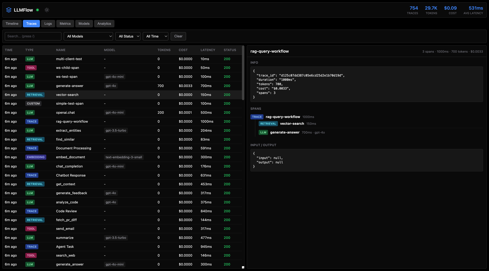

# LLMFlow

**See what your LLM calls cost. One command. No signup.**

LLMFlow is a local observability tool for LLM applications. Point your SDK at it, see your costs, tokens, and latency in real-time.

```bash
npx llmflow
```

Dashboard: [localhost:3000](http://localhost:3000) · Proxy: [localhost:8080](http://localhost:8080)



---

## Quick Start

### 1. Start LLMFlow

```bash
# Option A: npx (recommended)
npx llmflow

# Option B: Clone and run (requires Bun)
git clone https://github.com/HelgeSverre/llmflow.git
cd llmflow && bun install && bun run dev

# Option C: Docker
docker run -p 3000:3000 -p 8080:8080 helgesverre/llmflow
```

### 2. Point Your SDK

```python
# Python
from openai import OpenAI
client = OpenAI(base_url="http://localhost:8080/v1")
```

```javascript
// JavaScript
const client = new OpenAI({ baseURL: 'http://localhost:8080/v1' })
```

```php
// PHP
$client = OpenAI::factory()->withBaseUri('http://localhost:8080/v1')->make();
```

### 3. View Dashboard

Open [localhost:3000](http://localhost:3000) to see your traces, costs, and token usage.

---

## Who Is This For?

- **Solo developers** building with OpenAI, Anthropic, etc.
- **Hobbyists** who want to see what their AI projects cost
- **Anyone** who doesn't want to pay for or set up a SaaS observability tool

---

## Features

| Feature                 | Description                                                                                 |
| ----------------------- | ------------------------------------------------------------------------------------------- |
| **Cost Tracking**       | Real-time pricing for 2000+ models                                                          |
| **Request Logging**     | See every request/response with latency                                                     |
| **Multi-Provider**      | OpenAI, Anthropic, Gemini, Ollama, Groq, Mistral, and more                                  |
| **OpenTelemetry**       | Accept OTLP/HTTP traces from LangChain, LlamaIndex, Traceloop, Vercel AI SDK, etc.          |
| **Session correlation** | Group multi-turn agent runs under one session via `session.id` (OpenInference / OTel)       |
| **Span timeline**       | Virtualized waterfall view; ~5k spans per trace stays smooth                                |
| **Zero Config**         | Just run it, point your SDK, done                                                           |
| **Local Storage**       | SQLite database, no external services                                                       |

---

## Supported Providers

Use path prefixes or the `X-LLMFlow-Provider` header:

| Provider     | URL                                   |
| ------------ | ------------------------------------- |
| OpenAI       | `http://localhost:8080/v1` (default)  |
| Anthropic    | `http://localhost:8080/anthropic/v1`  |
| Gemini       | `http://localhost:8080/gemini/v1`     |
| Ollama       | `http://localhost:8080/ollama/v1`     |
| Groq         | `http://localhost:8080/groq/v1`       |
| Mistral      | `http://localhost:8080/mistral/v1`    |
| Azure OpenAI | `http://localhost:8080/azure/v1`      |
| Cohere       | `http://localhost:8080/cohere/v1`     |
| Together     | `http://localhost:8080/together/v1`   |
| OpenRouter   | `http://localhost:8080/openrouter/v1` |
| Perplexity   | `http://localhost:8080/perplexity/v1` |

---

## OpenTelemetry Support

If you're using LangChain, LlamaIndex, or other instrumented frameworks:

```python
# Python - point OTLP exporter to LLMFlow
from opentelemetry.exporter.otlp.proto.http.trace_exporter import OTLPSpanExporter

exporter = OTLPSpanExporter(endpoint="http://localhost:3000/v1/traces")
```

```javascript
// JavaScript
import { OTLPTraceExporter } from '@opentelemetry/exporter-trace-otlp-http'

new OTLPTraceExporter({ url: 'http://localhost:3000/v1/traces' })
```

### Session correlation

If your spans carry one of these attributes, LLMFlow groups multiple traces into
a single session and exposes them in the **Sessions** tab:

| Convention                                       | Attribute                                        |
| ------------------------------------------------ | ------------------------------------------------ |
| OpenInference / Phoenix / Arize                  | `session.id` _(recommended)_                     |
| LangSmith                                        | `langsmith.trace.session_id`                     |
| Traceloop / OpenLLMetry                          | `traceloop.association.properties.session_id`    |
| Vercel AI SDK                                    | `ai.telemetry.metadata.sessionId`                |
| OTel resource fallback                           | `service.instance.id` resource attribute         |

For chat-thread correlation, set `gen_ai.conversation.id` (OTel) or
`traceloop.association.properties.thread_id`.

---

## Configuration

| Variable         | Default      | Description                                                  |
| ---------------- | ------------ | ------------------------------------------------------------ |
| `PROXY_PORT`     | `8080`       | Proxy port                                                   |
| `DASHBOARD_PORT` | `3000`       | Dashboard + OTLP receiver port (npx falls back to 1337)      |
| `DATA_DIR`       | `~/.llmflow` | Data directory                                               |
| `MAX_TRACES`     | `10000`      | Max traces to retain                                         |
| `VERBOSE`        | `0`          | Enable verbose logging                                       |

Set provider API keys as environment variables (`OPENAI_API_KEY`, `ANTHROPIC_API_KEY`, etc.) if you want the proxy to forward requests.

---

## Development

LLMFlow is a Bun workspaces monorepo (`apps/server`, `apps/dashboard`, plus
six packages under `packages/`). Bun is required.

```bash
# Clone and install (one workspace install at root covers every package)
git clone https://github.com/HelgeSverre/llmflow.git
cd llmflow && bun install

# Server (dashboard on :3000, proxy on :8080)
bun run dev

# Dashboard dev server with HMR (separate terminal, proxies /api + /ws)
bun run dev:dashboard

# Build dashboard for production (outputs to /public/)
bun run build

# Tests
bun run test                # server unit/integration
bun run --filter @llmflow/dashboard test    # viewport vitest suite
bun run test:e2e            # Playwright
```

The dashboard is Svelte 5 + Vite 8 and builds to `/public/` at the repo root.
The bin entry `bin/llmflow.js` (used by `npx llmflow`) spawns
`apps/server/src/server.ts` directly.

---

## Advanced Features

For advanced usage, see the [docs/](docs/) folder:

- [AI CLI Tools](docs/guides/ai-cli-tools.md) - Claude Code, Codex CLI, Gemini CLI
- [Observability Backends](docs/guides/observability-backends.md) - Export to Jaeger, Langfuse, Phoenix
- [Passthrough Mode](docs/guides/ai-cli-tools.md#passthrough-mode) - Forward native API formats

---

## License

MIT © [Helge Sverre](https://github.com/HelgeSverre)
