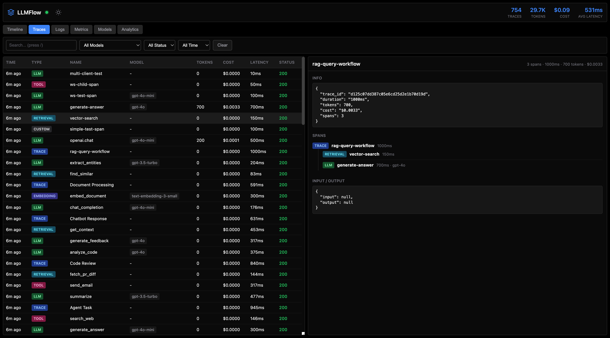

# LLMFlow

**See what your LLM calls cost. One command. No signup.**

LLMFlow is a local observability tool for LLM applications. Point your SDK at it, see your costs, tokens, and latency in real-time.

Install [Bun](https://bun.sh/docs/installation) first; the npm launcher requires Node.js and runs the server with Bun.

```bash
npx llmflow
```

Dashboard: [localhost:1337](http://localhost:1337) · Proxy: [localhost:8080](http://localhost:8080)



---

## Quick Start

### 1. Start LLMFlow

```bash
# Option A: npx (recommended)
npx llmflow

# Option B: Clone and run (requires Bun)
git clone https://github.com/HelgeSverre/llmflow.git
cd llmflow && bun install && bun run dev

# Option C: Docker
docker run -p 127.0.0.1:1337:1337 -p 127.0.0.1:8080:8080 helgesverre/llmflow
```

### 2. Point Your SDK

```python
# Python
from openai import OpenAI
client = OpenAI(base_url="http://localhost:8080/v1")
```

```javascript
// JavaScript
const client = new OpenAI({ baseURL: 'http://localhost:8080/v1' })
```

```php
// PHP
$client = OpenAI::factory()->withBaseUri('http://localhost:8080/v1')->make();
```

### 3. View Dashboard

Open [localhost:1337](http://localhost:1337) to see your traces, costs, and token usage.

---

## Who Is This For?

- **Solo developers** building with OpenAI, Anthropic, etc.
- **Hobbyists** who want to see what their AI projects cost
- **Anyone** who doesn't want to pay for or set up a SaaS observability tool

---

## Features

| Feature                 | Description                                                                           |
| ----------------------- | ------------------------------------------------------------------------------------- |
| **Cost Tracking**       | Real-time pricing for 2000+ models                                                    |
| **Request Logging**     | See every request/response with latency                                               |
| **Multi-Provider**      | OpenAI, Anthropic, Gemini, Ollama, Groq, Mistral, and more                            |
| **OpenTelemetry**       | Accept OTLP/HTTP traces from LangChain, LlamaIndex, Traceloop, Vercel AI SDK, etc.    |
| **Session correlation** | Group multi-turn agent runs under one session via `session.id` (OpenInference / OTel) |
| **Span timeline**       | Virtualized waterfall view; ~5k spans per trace stays smooth                          |
| **Zero Config**         | Just run it, point your SDK, done                                                     |
| **Local Storage**       | SQLite database, no external services                                                 |

---

## Supported Providers

Use path prefixes or the `X-LLMFlow-Provider` header:

| Provider     | URL                                   |
| ------------ | ------------------------------------- |
| OpenAI       | `http://localhost:8080/v1` (default)  |
| Anthropic    | `http://localhost:8080/anthropic/v1`  |
| Gemini       | `http://localhost:8080/gemini/v1`     |
| Ollama       | `http://localhost:8080/ollama/v1`     |
| Groq         | `http://localhost:8080/groq/v1`       |
| Mistral      | `http://localhost:8080/mistral/v1`    |
| Azure OpenAI | `http://localhost:8080/azure/v1`      |
| Cohere       | `http://localhost:8080/cohere/v1`     |
| Together     | `http://localhost:8080/together/v1`   |
| OpenRouter   | `http://localhost:8080/openrouter/v1` |
| Perplexity   | `http://localhost:8080/perplexity/v1` |

---

## OpenTelemetry Support

If you're using LangChain, LlamaIndex, or other instrumented frameworks:

```python
# Python - point OTLP exporter to LLMFlow
from opentelemetry.exporter.otlp.proto.http.trace_exporter import OTLPSpanExporter

exporter = OTLPSpanExporter(endpoint="http://localhost:1337/v1/traces")
```

```javascript
// JavaScript
import { OTLPTraceExporter } from '@opentelemetry/exporter-trace-otlp-http'

new OTLPTraceExporter({ url: 'http://localhost:1337/v1/traces' })
```

LLMFlow accepts both the current
[OpenTelemetry GenAI semantic conventions](https://opentelemetry.io/docs/specs/semconv/gen-ai/)
(`gen_ai.provider.name`, `gen_ai.usage.input_tokens`, structured
`gen_ai.input.messages`, etc.) and the deprecated v1.36.0 names
(`gen_ai.system`, `gen_ai.usage.prompt_tokens`). See
[GenAI semantic conventions](docs/guides/genai-semconv.md) for the full key
list, precedence rules, and the `LLMFLOW_OTLP_LEGACY_ATTRS` export flag.

### Session correlation

If your spans carry one of these attributes, LLMFlow groups multiple traces into
a single session and exposes them in the **Sessions** tab:

| Convention                      | Attribute                                     |
| ------------------------------- | --------------------------------------------- |
| OpenInference / Phoenix / Arize | `session.id` _(recommended)_                  |
| LangSmith                       | `langsmith.trace.session_id`                  |
| Traceloop / OpenLLMetry         | `traceloop.association.properties.session_id` |
| Vercel AI SDK                   | `ai.telemetry.metadata.sessionId`             |
| OTel resource fallback          | `service.instance.id` resource attribute      |

For chat-thread correlation, set `gen_ai.conversation.id` (OTel) or
`traceloop.association.properties.thread_id`.

---

## Configuration

| Variable         | Default      | Description                                       |
| ---------------- | ------------ | ------------------------------------------------- |
| `PROXY_HOST`     | `127.0.0.1`  | Proxy listener address                            |
| `DASHBOARD_HOST` | `127.0.0.1`  | Dashboard and OTLP listener address               |
| `PROXY_PORT`     | `8080`       | Proxy port                                        |
| `DASHBOARD_PORT` | `1337`       | Dashboard + OTLP receiver port                    |
| `DATA_DIR`       | `~/.llmflow` | Data directory                                    |
| `MAX_TRACES`     | `10000`      | Maximum retained span rows (whole-trace eviction) |
| `VERBOSE`        | `0`          | Enable verbose logging                            |

Set provider API keys as environment variables (`OPENAI_API_KEY`, `ANTHROPIC_API_KEY`, etc.) if you want the proxy to forward requests.

---

## Pricing data

The "what your LLM calls cost" number comes from a live model price table — there's no hand-maintained cost lookup in this repo. Two things matter for trust in that number:

**Source.** `@llmflow/pricing` pulls [BerriAI/litellm's `model_prices_and_context_window.json`](https://github.com/BerriAI/litellm/blob/main/model_prices_and_context_window.json) over HTTPS on boot and again every 24 hours. That's the canonical community-maintained table for ~2000 models across OpenAI, Anthropic, Google, Azure, Cohere, Mistral, Together, OpenRouter, Perplexity, Groq, and Ollama. Override the URL with `PRICING_URL` if you mirror it internally.

**Fallback.** If the boot-time fetch fails (offline laptop, blocked egress, LiteLLM is down), LLMFlow falls back to the bundled snapshot at `packages/pricing/pricing.fallback.json`. Costs keep being calculated, but rates are frozen to whatever was current when that file was last regenerated.

**How to tell which one you're on.** Hit `GET /api/health`:

```json
{
  "status": "ok",
  "timestamp": 1716800000000,
  "pricing": {
    "source": "litellm", // or "fallback" / "unknown"
    "last_updated": 1716799000000, // ms since epoch
    "model_count": 2143,
    "upstream_url": "https://raw.githubusercontent.com/BerriAI/litellm/..."
  }
}
```

The dashboard shows a warning banner when `source: "fallback"` and the data is more than 7 days old.

**Refreshing manually.** A restart re-fetches. If you can't restart, the background refresh runs every 24 hours. To regenerate the bundled fallback file (for offline installs), curl the upstream JSON into `packages/pricing/pricing.fallback.json` and commit it.

**When pricing is unknown.** For models that don't appear in the table, LLMFlow falls back to a generic placeholder rate (`$0.001 / 1k prompt tokens`, `$0.002 / 1k completion tokens`). Cost numbers for those models are indicative only — check `/api/health` and the Models tab to see which models are unmatched.

---

## Security

LLMFlow is designed to run on `localhost`. It has no built-in authentication today, so anything that can reach the ports can read your traces and send requests to your provider keys.

**Default binding.** Native dashboard/OTLP and proxy listeners bind to `127.0.0.1`. Set `DASHBOARD_HOST` and `PROXY_HOST` explicitly for remote access. Startup output reports each listener's actual address.

```bash
# Explicit network access; place behind authenticated access on a trusted network
DASHBOARD_HOST=0.0.0.0 PROXY_HOST=0.0.0.0 npx llmflow

# Containers listen on all container interfaces; publish only on host loopback
docker run -p 127.0.0.1:1337:1337 -p 127.0.0.1:8080:8080 helgesverre/llmflow
```

The supplied Compose configuration explicitly binds both listeners to `0.0.0.0` inside the container and publishes both ports on host loopback. Run it with `docker compose -f docker/docker-compose.yml up --build`. Changing the host-side publishing address enables network access; it does not add authentication.

**Provider keys.** `OPENAI_API_KEY`, `ANTHROPIC_API_KEY`, etc. live in the environment of the LLMFlow process. Anyone who can hit `/v1/*` can spend against them — treat the listening surface accordingly.

**OTLP receiver.** The OTLP endpoints (`POST /v1/traces`, `/v1/logs`, `/v1/metrics`) sit on the dashboard port and accept any well-formed payload. If you open `:1337` to the network, expect arbitrary spans to land in your local SQLite.

LLMFlow intentionally requires no login or token setup for local use. WebSocket Origin validation is implemented; built-in bearer authentication is not planned.

---

## Development

LLMFlow is a Bun workspaces monorepo (`apps/server`, `apps/dashboard`, plus
six packages under `packages/`). Bun is required.

```bash
# Clone and install (one workspace install at root covers every package)
git clone https://github.com/HelgeSverre/llmflow.git
cd llmflow && bun install

# Start server (dashboard on :1337, proxy on :8080) and Vite HMR dashboard
# together. Vite proxies /api and /ws back to the server.
bun run dev

# Or restart just one of them:
bun run dev:server      # backend only
bun run dev:dashboard   # Vite HMR only

# Build dashboard for production (outputs to /public/)
bun run build

# Tests
bun run test                # server unit/integration
bun run --filter @llmflow/dashboard test    # viewport vitest suite
bun run test:e2e            # Playwright
```

The dashboard is Svelte 5 + Vite 8 and builds to `/public/` at the repo root.
The bin entry `bin/llmflow.js` (used by `npx llmflow`) spawns
the bundled `dist/server.js` in npm installations (source in an unbuilt checkout).
`bun run build` generates both the dashboard and the self-contained Bun server.
`bun run test:package` verifies the packed artifact in a fresh consumer project.

---

For filtering, trace inspection, session navigation and value conventions, see the [dashboard guide](docs/guides/dashboard.md).

## Advanced Features

For advanced usage, see the [docs/](docs/) folder:

- [AI CLI Tools](docs/guides/ai-cli-tools.md) - Claude Code, Codex CLI, Gemini CLI
- [Observability Backends](docs/guides/observability-backends.md) - Export to Jaeger, Langfuse, Phoenix
- [GenAI Semantic Conventions](docs/guides/genai-semconv.md) - Supported `gen_ai.*` attributes (current + legacy)
- [Passthrough Mode](docs/guides/ai-cli-tools.md#passthrough-mode) - Forward native API formats

---

## License

MIT © [Helge Sverre](https://github.com/HelgeSverre)

### Regression checks

`bun run --filter '*' typecheck` checks all workspace types. `bun run --filter @llmflow/dashboard test` covers trace selection ordering and viewport updates. `bun test apps/server/test/reviewed-fixes.test.ts` exercises listener binding, OTLP ingestion, message preservation, and token/cost persistence with a temporary database and deterministic pricing.

Run `bunx playwright install chromium` once, then `bun run test:e2e`. Playwright builds the dashboard, starts an isolated seeded server on available loopback ports, and cleans up its temporary database. Trace-viewer tests save desktop/narrow screenshots in light and dark themes under `test-results/`.

Trace-tree API responses remain nested using `timestamp` and `span_name`; the dashboard adapts them once in `lib/trace/tree.ts`. Within a mounted trace, span updates preserve valid selection and collapsed branches; switching trace IDs resets selection, expansion, and scroll position.

### Runtime and retention policy

- Dashboard/OTLP and SDK default to `http://127.0.0.1:1337`; the proxy defaults to `http://127.0.0.1:8080`. A requested port already in use fails startup; the server never silently selects another port. Set `DASHBOARD_PORT` and the SDK's `LLMFLOW_URL` together for overrides. Port `0` is available for tests; startup prints the actual assigned URLs.
- WebSocket upgrades require an exact trusted Origin. Loopback dashboard origins at the listening port are accepted. For a reverse proxy, explicitly set `WS_ALLOWED_ORIGINS=https://your-dashboard.example`; forwarded headers do not grant access. The Vite dev command allows its local port 5173. Native WebSocket clients must send an allowed Origin too.
- Proxy socket idle timeouts are disabled to permit slow LLM responses and quiet streams. `PROXY_TIMEOUT_MS` sets the overall upstream deadline (default 300000 ms), including body consumption. Downstream cancellation aborts upstream work. Capture is bounded to 2 MiB of text, 1 MiB per tool argument, 4 MiB per streaming frame and 16 MiB for non-streaming responses.
- OTLP/HTTP accepts JSON and protobuf with identity or gzip encoding for traces, logs and metrics. Encoded input is limited to 4 MiB and decompressed output to 16 MiB. Missing/nonpositive/invalid timestamps are absent: logs prefer event time, then observed time, then ingestion time; metrics use ingestion time; spans use the valid endpoint or ingestion time, with zero duration unless both endpoints form a valid interval.
- `MAX_TRACES` bounds span rows. Overflow evicts the logical trace with the oldest latest-span timestamp as a unit, including active traces when necessary. A single trace larger than the cap is evicted completely. Independent rows form their own logical traces. Up to `MAX_TRACES` eviction markers identify late fragments; missing-parent checks also mark partial trees. Totals describe retained data. Session ownership prefers a root annotation, otherwise the earliest annotated span (ID breaks ties); all retained descendants contribute.
- Model input/output token totals use recorded counts. Average latency is in milliseconds across LLM spans with a recorded nonnegative duration; absent measurements display `-`.
- Credentials in diagnostic request/response headers and credential query parameters are redacted before persistence and notification. A versioned migration scrubs existing rows and vacuums/checkpoints the database. Backups and external copies made before upgrading are not rewritten. Another one-off migration repairs historical zero log timestamps with valid observed times.

The server test runner uses a new temporary database and ports for every run, overriding inherited database settings. Default tests use local fixtures; live provider tests are opt-in through `bun run test:providers-e2e` or `bun run --filter @llmflow/server test passthrough-e2e.js` and require credentials. To include the real Python protobuf/gzip integration, install `opentelemetry-sdk` and `opentelemetry-exporter-otlp-proto-http`, then run `LLMFLOW_PYTHON=python3 bun run test`.

### Replay a captured request

In **Traces**, select a captured request and click **Replay request**. LLMFlow runs
a new provider request and opens its separate trace; the original capture stays
unchanged. Streaming requests follow the same proxy path.

Replay currently supports POST requests through the normalized proxy, including
Ollama. For hosted providers, configure the corresponding API key in the LLMFlow
server environment (for example, `OPENAI_API_KEY` or `ANTHROPIC_API_KEY`) and
restart. Stored credentials are redacted and are never reused. Telemetry-only
spans, native passthrough requests, incomplete bodies and URLs containing
redacted parameters cannot be replayed from the dashboard.

### Live provider checks

The default test suite uses local fixtures. Optional live checks make billable requests and
require working provider credentials and account credit:

```bash
PROVIDERS=openai,anthropic,cohere,mistral bun run test:providers-e2e
PROVIDERS=openai,anthropic bun run apps/server/test/run-tests.js passthrough-e2e.js
```

Both suites honor `PROVIDERS`. Override a model with
`LLMFLOW_TEST_<PROVIDER>_MODEL`, for example
`LLMFLOW_TEST_ANTHROPIC_MODEL=claude-haiku-4-5`. Defaults live in
[`live-providers.js`](apps/server/test/lib/live-providers.js); choose an available model
for your account when a provider changes availability. Azure additionally requires
`AZURE_OPENAI_DEPLOYMENT`; Ollama requires a running server and an installed model.
Missing credentials or excluded providers are reported as skipped. Upstream authentication,
model-access, quota and billing errors remain failures with their HTTP status and message;
they are not silently counted as passes.
